 <h2 align="center"> Spring API e MySQL</h2> 


 <div> 

[](https://skillicons.dev)


> > ℹ️ According to the official MySQL website, it is very popular all over the world:


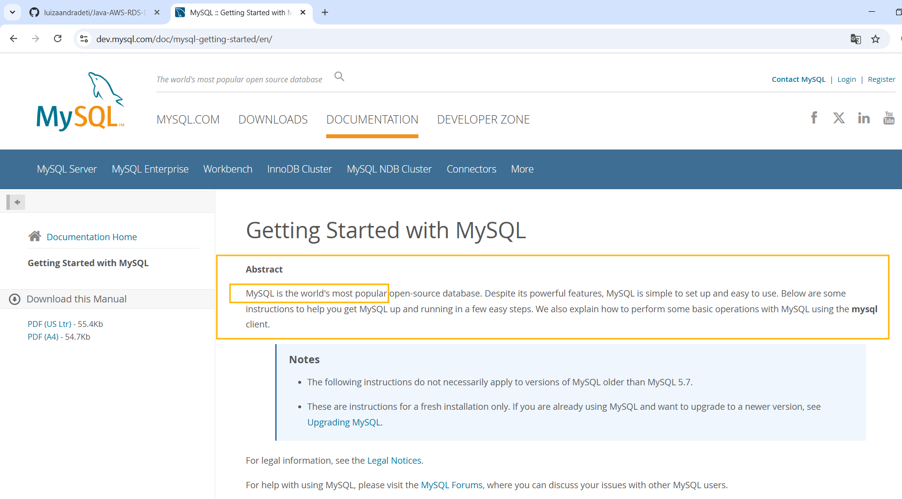 

- https://dev.mysql.com/doc/mysql-getting-started/en/

> > ℹ️ MySQL is very popular and used in large, medium and small companies. For technical information, always consult the official documentation, as it contains the most reliable technical references on how the Database Management System in question works

[](/#/)

This material is study personal and does not replace official documentation, always follow the official documentation.

</div> 

## 🔗 Links

[](https://br.linkedin.com/in/luiza-andrade-ti/) [](https://github.com/luizaandradeti/)


- [Tech Stack](#tech-stack)
- [Create Project](#1-create-spring-project-)
- [Request](#2-view-)
- [Setup docker local](#3-setup-database-local-with-docker-test---local-environment)
- [Connection SQL local](#4-connection---local-database-docker-composeyml)
  * [Run](#41-run-api-local)
  * [Request with output in the browser](#42-request-api-browser--method-get-database-local)
  * [Request](#43-request-in-postman---method-get-local-database-)
- [Connection SQL RDS](#5-connection-with-rds-database-cloud---dev-environment-) 
- [AWS metrics](#7-micrometer-with-aws-cloud-watch---img-srchttpsd2q66yyjeovezocloudfrontneticon8f57ebd825a828e205b2dde223ba17e4-6af63a22dc297f8041286760ee8cd2c9svg-atd)
- [Read more | references](#8-read-more--references)

## Tech Stack 
**Client:** Postman
**Backend softwares:** Java 17, IntelliJ

## Get Started  

### 1. Create Spring Project  ⚡️
- https://start.spring.io/ 
    - Spring Web 
    - Spring Boot DevTools Developer Tools
  
### Requisite Level
Developer Mid-senior 

### 2. View 

 **Localhost:8080/home**

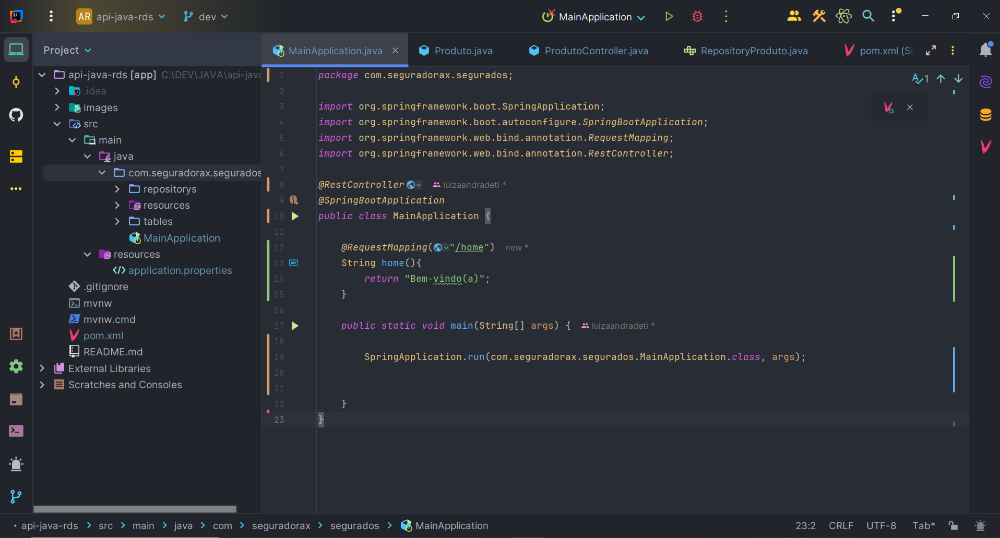 


### 3. Setup Database local with docker (test - local environment)


4. Connection - local database (docker-compose.yml)
DbEaver connection MySql


##### 4.1 Run API (local)
<div>
	
</div>
##### 4.2 Request api Browser- method get (database local)


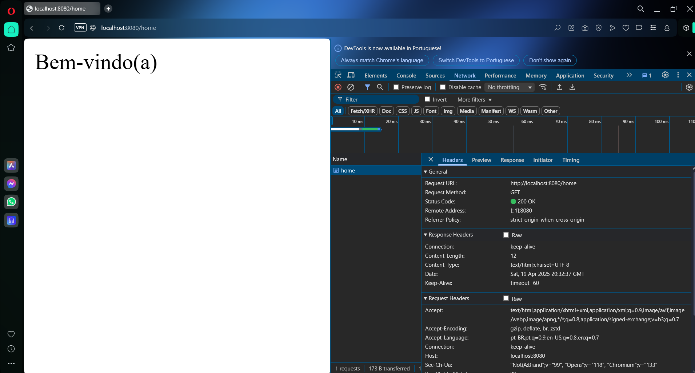

##### 4.3 Request in Postman - method get (local database)


#### 5. Connection with RDS Database  (cloud - dev environment) 

*Include the JPA and MySQL lib in the pom xml, to connect the api to the AWS database and perform queries and data persistence through ORM*

[]([https://mvnrepository.com/search?q=MYSQL)

[](https://mvnrepository.com/artifact/jakarta.persistence/jakarta.persistence-api/3.2.0)

[](https://mvnrepository.com/artifact/org.springframework.boot/spring-boot-starter-test/3.4.4)

````xml
	<dependency>
		<groupId>mysql</groupId>
		<artifactId>mysql-connector-java</artifactId>
		<version>8.0.33</version>
	</dependency>

	<dependency>
		<groupId>jakarta.persistence</groupId>
		<artifactId>jakarta.persistence-api</artifactId>
	</dependency>

	<dependency>
   		<groupId>org.springframework.boot</groupId>
    	<artifactId>spring-boot-starter-data-jpa</artifactId>
    </dependency>

````


###  6. DBeaver connection to AWS RDS database in dev environment 

- Personal account 
Create a DB and connect 
- 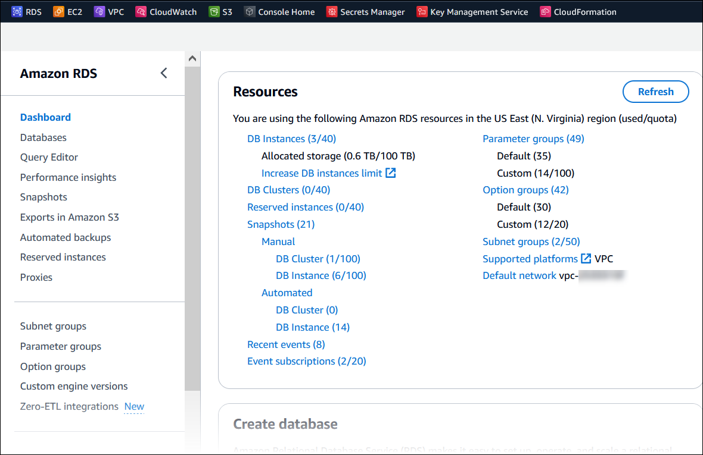
- 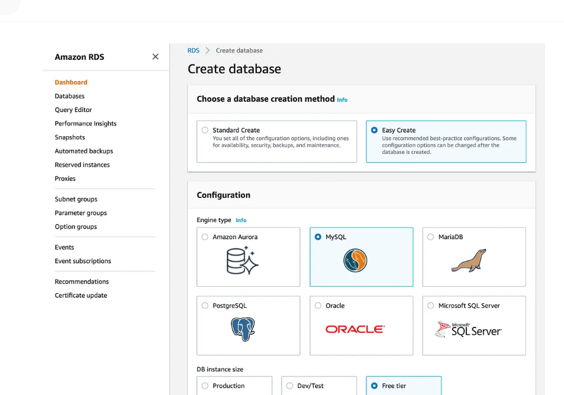
- 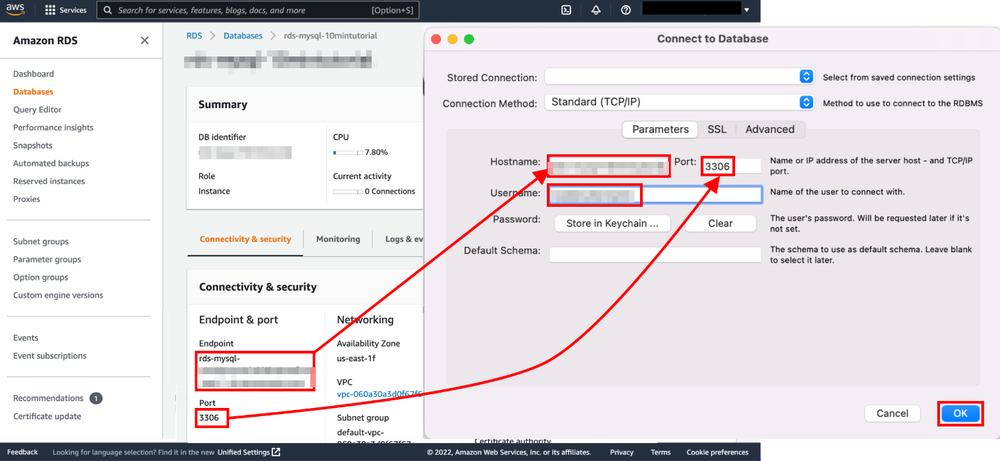<center><font size="1">https://aws.amazon.com/pt/getting-started/hands-on/create-mysql-db/</font></center>

**Example:**

AWS RDS in the application.properties file with the dev password 

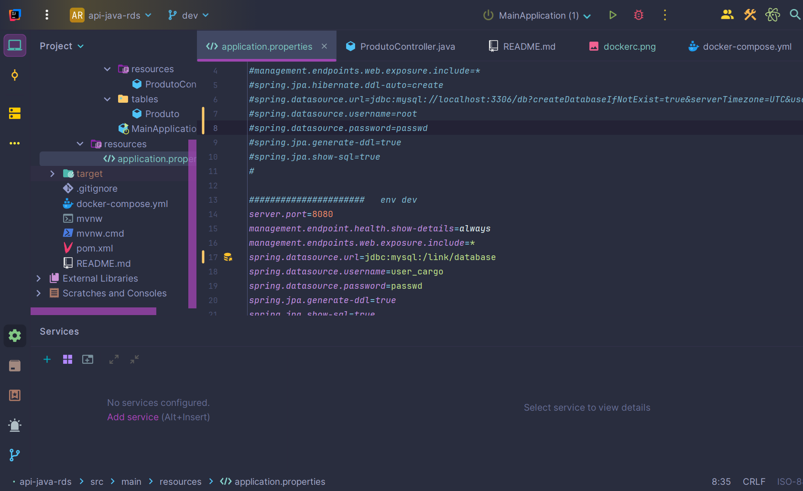

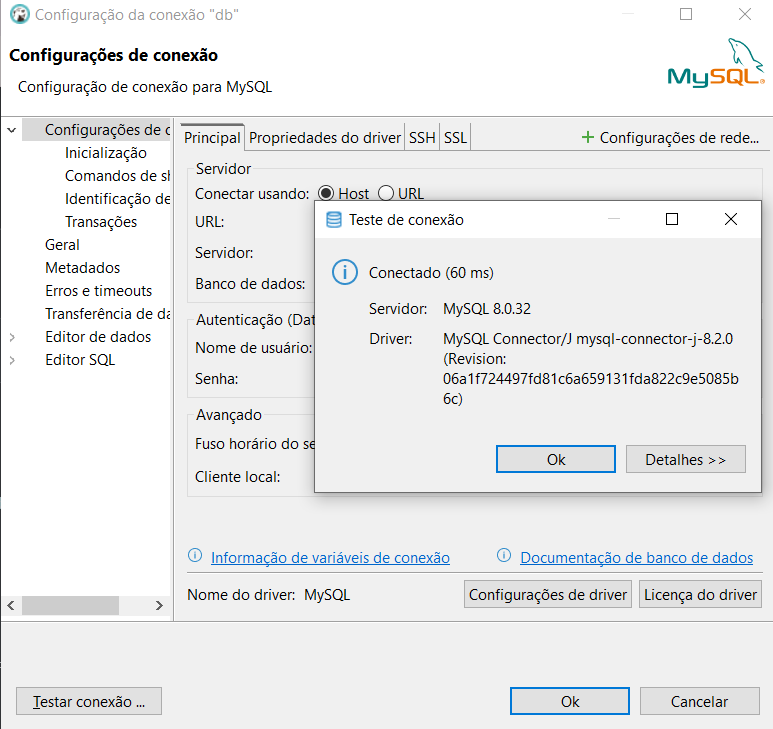

- Example with table and jpa classes (product class and repository interface)


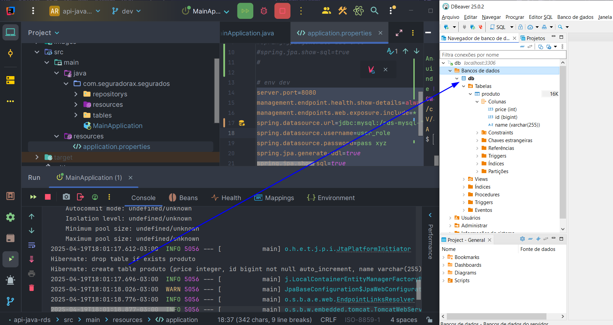

> [!NOTE]
> The context of these personal studies is strictly technical.
>
> The subjects described here are technical and for professional and personal study.
> Please do not use terms out of context! The terms mentioned here were written in the literal sense, in the strictly technical sense.

#### 6.1 Troubleshooting 
When creating a new account, the permissions are for the root user, as this is the account of the person or company that created it.
It is important to have accounts, users and roles with granular permission.

- https://docs.aws.amazon.com/organizations/latest/userguide/orgs_getting-started_concepts.html
- https://docs.aws.amazon.com/IAM/latest/UserGuide/id_root-user.html#root-user-tasks
  
  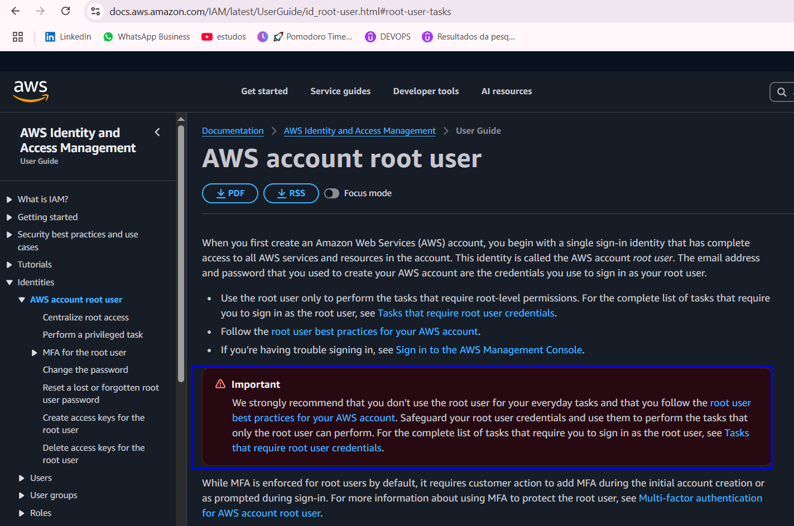

<div>
	  
</div>


<div>
	  
</div>


  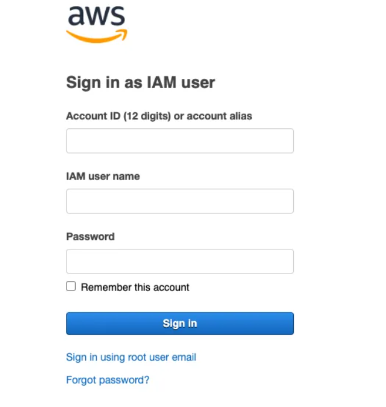
  
If you have a corporate user on a company-granted account who doesn't have access (login) yet, or has lost it, and is asked to perform a task that requires that access, you can recover that information by requesting it from the authorized technology administrator (usually through an internal ticket, such as Service Now), who will retrieve it through AWS IAM. You will need to consult with your lead (who will show you the way to get this login recovery done within the timeframe stipulated by the SLA). Some companies purchase plans that include more support and AWS consultants to assist their development team. 

For a personal account with first-time users, it is useful to have official plans that meet this need.

- https://aws.amazon.com/premiumsupport/plans/
- https://www.servicenow.com/products/itsm/what-is-sla.html
  
  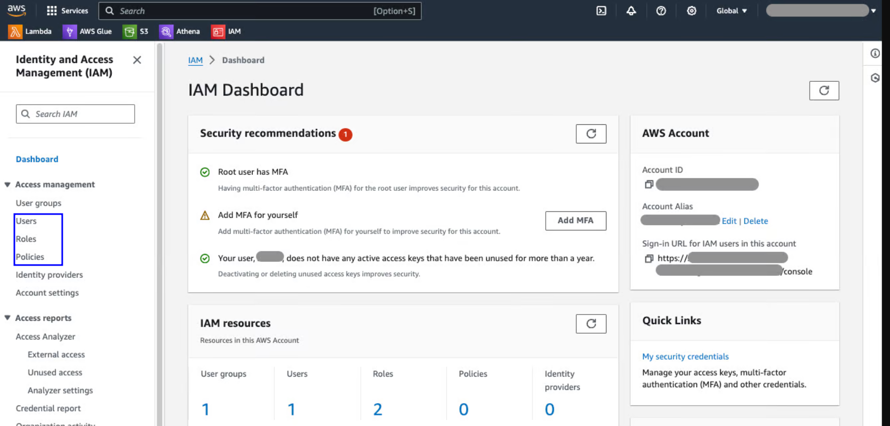
  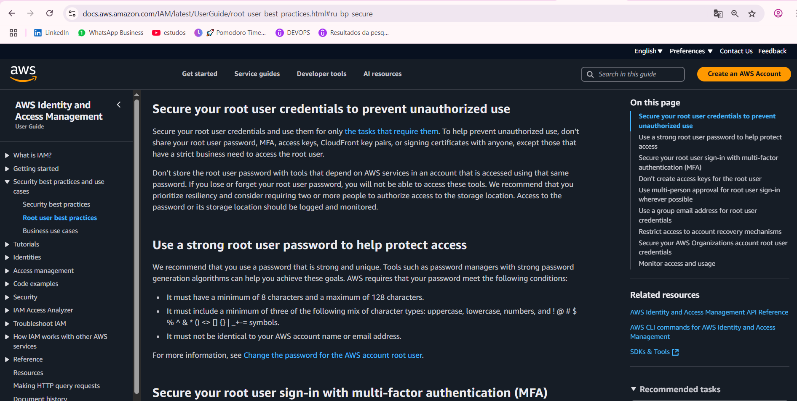

> [!Note]
> 
> Obviously, having an official consultant for the cloud you have purchased reduces many problems.
> Whatever the cloud, knowledge is crucial.

  
##### 6.1.1 If No access AWS Console (personal account)
https://www.youtube.com/watch?v=Ul6FW4UANGc - Introduction to AWS  Identity and Access Management on AWS (IAM)

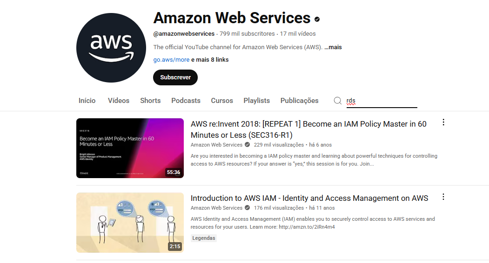
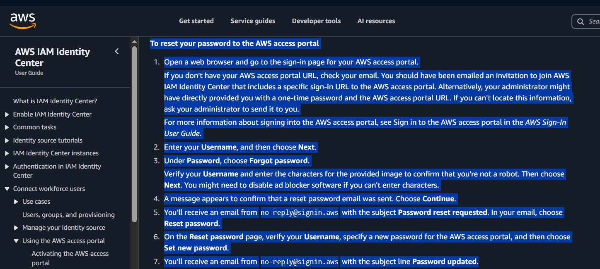


In case of lack of access, in non-root users, in personal accounts for study, it is necessary to assign this access to the user in the profile, in the user's assignments, from the user who has the scope with specific permission (allow) for this (assign actions).

- https://aws.amazon.com/premiumsupport/plans/
- https://www.servicenow.com/products/itsm/what-is-sla.html

https://docs.aws.amazon.com/IAM/latest/UserGuide/id_root-user.html
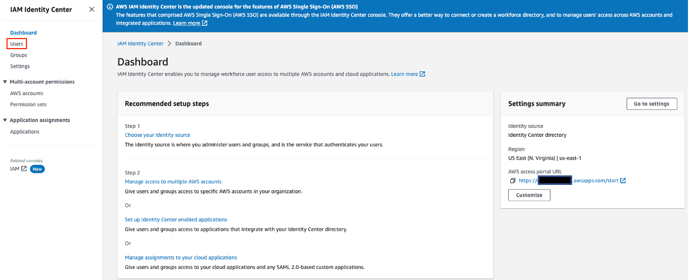


- https://docs.aws.amazon.com/pt_br/signin/latest/userguide/troubleshooting-sign-in-issues.html#troubleshoot-forgot-iam-password

- https://aws.amazon.com/premiumsupport/plans/

##### 6.1.2 If No access AWS RDS (enterprise account)

> [!NOTE]
> 
> I recommend consulting the official documentation

If you have a corporate user from a company-granted account, and you do not yet have access (RDS), or have lost access to RDS, and are asked to perform a task that requires this access, you can easily retrieve this information by requesting it from the authorized technology administrator (usually via an internal ticket, e.g. Service Now), who will retrieve it through AWS IAM. You need to enable this specific permission (allow) if it is a task assigned directly to you.

You need to ask your leader, who will add this permission through AWS IAM or show you how to do it. The timeframe and method vary depending on the ticket model adopted, and it is crucial to follow good documentation practices.


- https://aws.amazon.com/premiumsupport/plans/
- https://www.servicenow.com/products/itsm/what-is-sla.html
- [(https://docs.aws.amazon.com/service-authorization/latest/reference/list_amazonrds.html](https://docs.aws.amazon.com/service-authorization/latest/reference/list_amazonrds.html)


##### 6.1.3 No access AWS RDS (personal account)
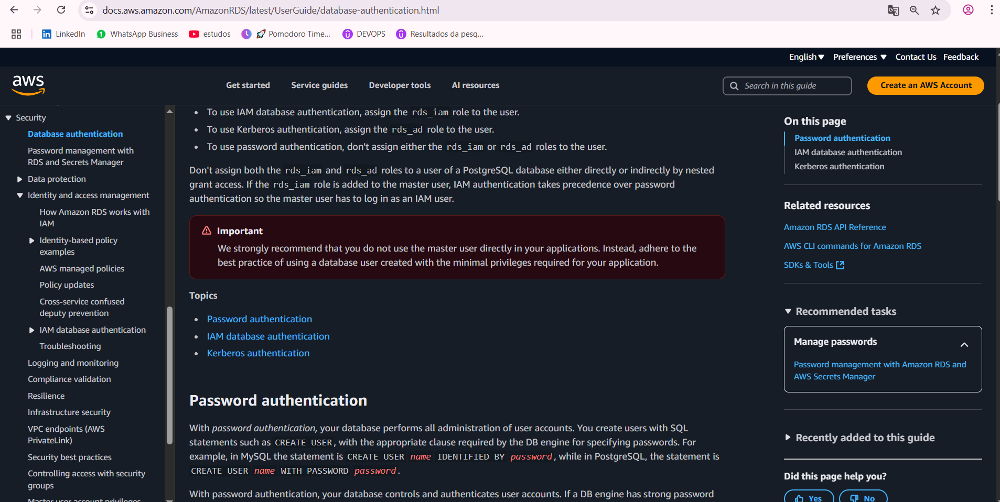


> [!IMPORTANT]
> If the account is personal for studies, without any connection to the company, the permission is configured in the user management panel.
> In general, all cloud resources, requires permission per user (the more granular the privilege, the more secure the environment), which can be done through the user management panel, according to the company's needs, in accordance with good practices:
> 
- https://docs.aws.amazon.com/

- https://github.com/aws

- https://docs.aws.amazon.com/AmazonRDS/latest/UserGuide/CHAP_Tutorials.html#CHAP_Tutorials.GitHub

- https://docs.aws.amazon.com/sdk-for-java/

- https://aws.amazon.com/pt/blogs/opensource/using-a-postgresql-database-with-amazon-rds-and-spring-boot/

- https://docs.aws.amazon.com/pt_br/AmazonRDS/latest/UserGuide/rds-secrets-manager.html

- https://docs.aws.amazon.com/pt_br/IAM/latest/UserGuide/id_groups.html

- https://docs.aws.amazon.com/IAM/latest/UserGuide/root-user-best-practices.html

- https://docs.aws.amazon.com/IAM/latest/UserGuide/best-practices.html

- https://www.ibm.com/docs/en/aix/7.3?topic=privileges-least-privilege-principle

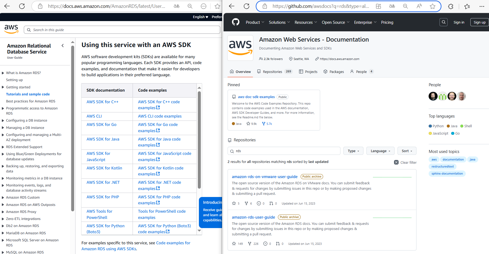


### 7.  Micrometer with AWS Cloud Watch - </a></td>
	

### Criation
This step will still be done in these personal studies.

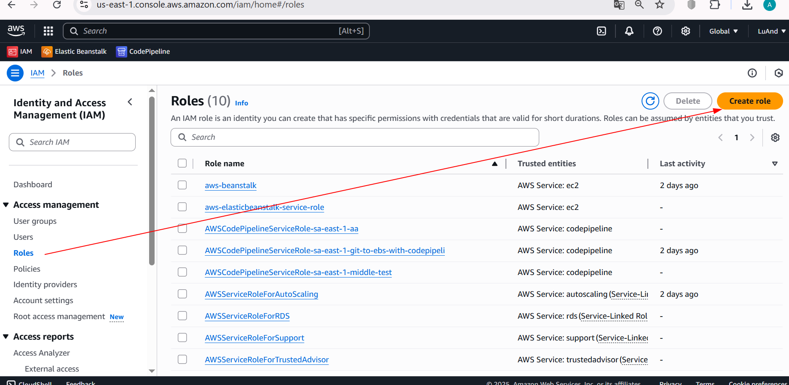
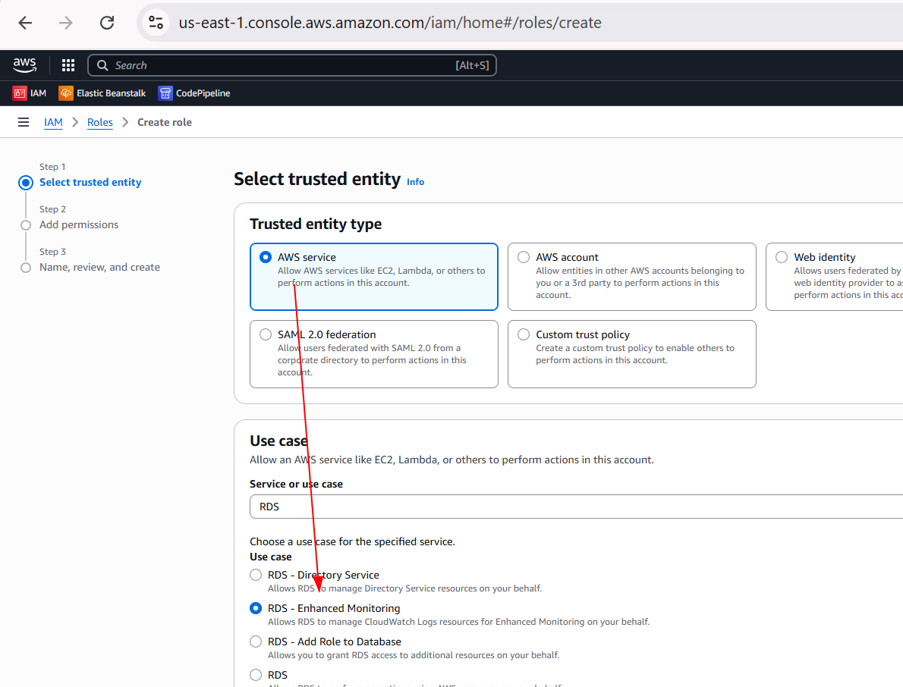

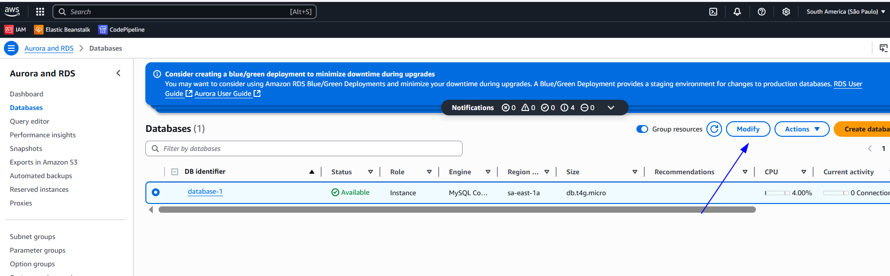
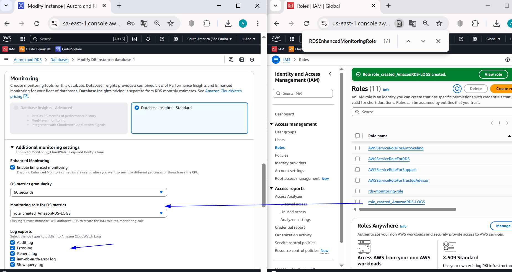
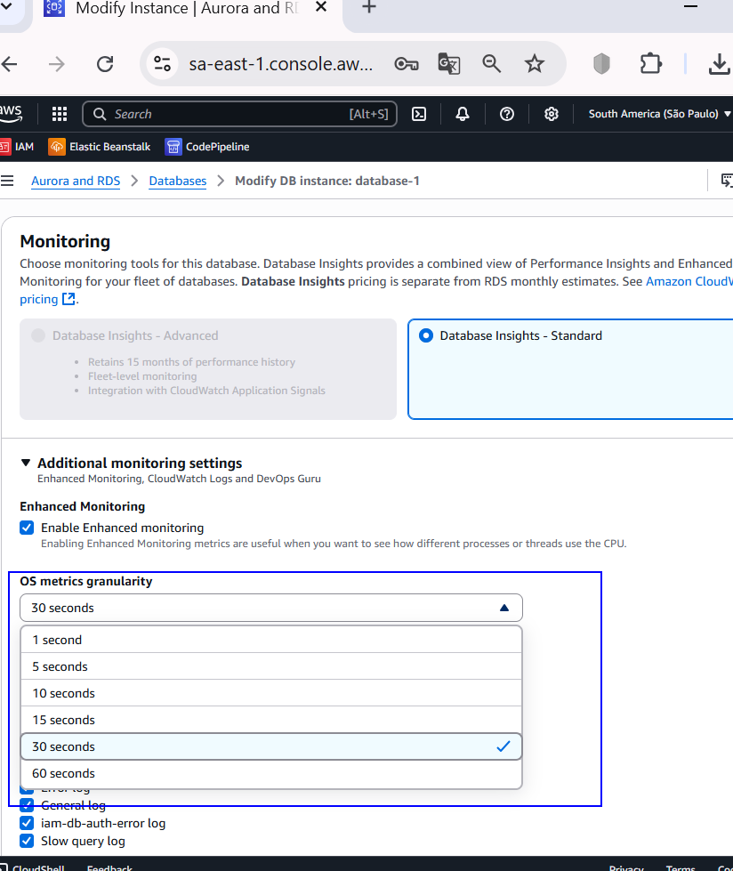
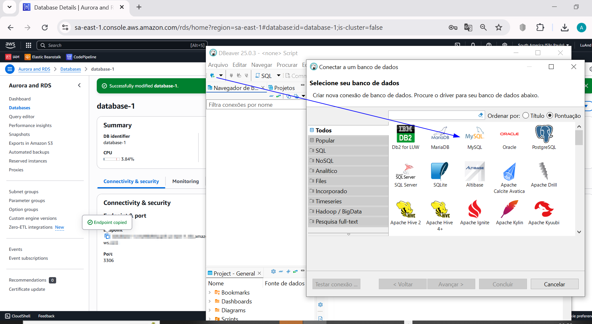


[](/#/)

> [!NOTE]
> 
> Repository for professional study purposes.
> This code does not address issues of politics, religion or agendas. 

